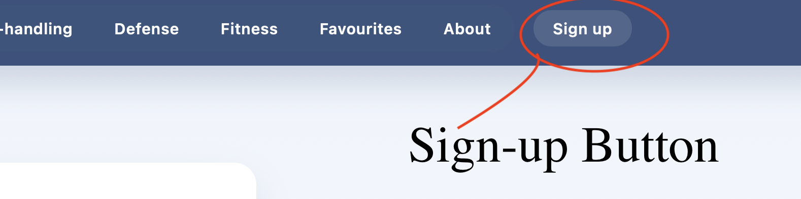

# HoopTutor – Basketball Training Resources Library
## Instructions For The User
1. Download file 
2. Import into Visual Studio Code
3. Run flask in the terminal and enter 'python main.py' for windows OS or 'python3 main.py' for mac OS

## Product Purpose
HoopTutor is the basketball training companion I am building to help high school players and coaches organise skill sessions faster. The app curates drills, workout plans, and teaching points into categories so a user can move from idea to practice plan quickly. The long term goal is to let a user personalise a training timeline and stay motivated through clear progress tracking.

Right now the prototype runs locally with a Flask back end and SQLite data store. The front end presents curated resources, early account management features, and the foundations for offline access through a progressive web app setup.

## Current Build Snapshot
- Players browse drills grouped by shooting, ball-handling, defense, and conditioning focus areas.
- Filter and search options reduce the time it takes to surface an appropriate drill set.
- Favourites are cached in local storage so a player keeps a personal playbook even if the connection drops.
- A SQL-backed catalogue keeps resource data consistent across pages and will power future personalisation.
- Initial service worker and manifest files are in place so the app can grow into a full PWA.

## Requirements and Scope
I opened the project by mapping the functional and non-functional expectations with my client. That agreement keeps every weekly sprint anchored to what matters.

### Functional requirements
- Welcome page presents four core training categories and recommended drills.
- Drill cards surface title, skill focus, difficulty, equipment needs, and media links.
- Search and filtering narrows the catalogue by difficulty, position, or focus area.
- Favourites allow a player to bookmark drills for later review using local storage.
- Player profile captures basic biography data to shape later recommendations.
- Admin workflow to seed and maintain drill data through structured forms.

### Non-functional requirements
- Loads quickly on school Wi-Fi thanks to compressed imagery and local caching.
- Responsive layouts prioritise mobile first while scaling cleanly to desktop.
- Interface follows consistent typography and contrast guidelines for accessibility.
- Error handling tells the user what went wrong and how to recover.
- Codebase is modular enough that future contributors can add drills or sports with minimal refactoring.

## Design Documentation
I experimented with two visual approaches to compare mood, navigation, and information density before committing to the production look and feel.

### Visual Identity Choices (Primary Concept)
| Element | Choice | Rationale |
| --- | --- | --- |
| Colour palette | Primary #274472, secondary #A3CEF1, neutral #F6F6F6 | Navy conveys trust, light blue keeps the tone instructional, and the light neutral lifts contrast. |
| Typography | Headings: Montserrat 700, body: Open Sans 400 | Montserrat gives confident structure while Open Sans stays readable during long drill descriptions. |
| Buttons | Rounded corners, filled primary colour on hover | Friendly to teen users and provides clear interaction feedback. |
| Icons | Minimal outline SVG set | Keeps focus on content while providing fast visual anchors. |
| Imagery | Action photography from practice sessions | Reinforces motivation and demonstrates correct technique. |
| Forms | Floating labels with generous spacing | Reduces cognitive load on mobile sign-up and login. |

### Alternative Exploration
| Element | Choice | Experiment Goal |
| --- | --- | --- |
| Colour palette | Black, white, and red accents | Test a bolder, high-contrast theme for elite training vibe. |
| Navigation | Side rail with condensed icons | Investigate vertical navigation for faster thumb reach on tablets. |
| Typography | Heavy condensed headings with light body text | Explore a sports-magazine feel and check readability limits. |
| Layout | Hero drill carousel above data cards | Gauge whether a storytelling approach beats a catalog layout. |
| CTA styling | Ghost buttons with thick borders | Validate whether contrast or filled buttons drive more taps. |

### Wireframes and Figma References
- Initial concept sketch: 
- Alternative flow in Figma: 

## Algorithm and Test Preparation
Week 4 focused on translating user flow into clear processing steps. I mapped the favourites feature because it touches both the interface and local storage.

### Test Cases
| Test Case ID | Scenario | Preconditions | Steps | Expected Result |
| --- | --- | --- | --- | --- |
| TC-FAV-01 | Save a new drill to favourites | User is logged in, drill not yet saved | 1. Open drill card 2. Select Save button | Drill id stored in local storage, toast confirmation appears, favourites badge increments. |
| TC-FAV-02 | Remove an existing favourite | Drill already saved | 1. Go to favourites list 2. Click Remove | Drill id removed from storage, badge decrements, toast confirms removal. |
| TC-FAV-03 | Prevent duplicate favourites | Drill already in list | 1. Attempt to save same drill again | System blocks duplicate, toast explains status, list unchanged. |
| TC-FAV-04 | Guest user saves a drill | Not logged in | 1. Save drill | Local storage stores drill for anonymous session, prompt invites user to sign in for sync later. |

## Data Model and SQL Work
During Week 5 I shaped the SQLite schema to reflect the way coaches talk about drills. Each table keeps relationships tidy and future friendly.

| Table | Purpose | Key Fields | Notes |
| --- | --- | --- | --- |
| users | Stores account and role data | id (PK), email, password_hash, role, created_at | Role field will gate coach vs player views. |
| categories | Defines skill groupings | id (PK), name, description | Seeded with shooting, ball-handling, defense, fitness. |
| drills | Core drill catalogue | id (PK), title, category_id (FK), difficulty, equipment, media_url, instructions | Difficulty stored as ENUM-like text for readability. |
| favourites | Bridges users and drills | id (PK), user_id (FK), drill_id (FK), created_at | Supports personalised playbooks and analytics later. |
| sessions | Planned practice sessions | id (PK), user_id (FK), session_date, notes | Placeholder for upcoming scheduling features. |

## Frontend Implementation Highlights (Weeks 6-8)
- Built three core pages: `index.html` for category discovery, `fitness.html` as a template for drill listings, and shared layouts in `layout.html` with the navigation partial.
- Applied the blue palette, consistent spacing, and hover states to keep the UI approachable while highlighting calls to action.
- Navigation enables movement between pages without disorientation, including a persistent menu partial for maintainability.
- Login and signup forms follow the floating-label approach from earlier sketches, reinforcing the design system.
- Client feedback praised the clarity of information but requested stronger alignment on small screens, which I resolved by tightening flexbox breakpoints.

## Interactivity and Offline Work (Weeks 9-10)
- Introduced service worker scaffolding, `manifest.json`, and `app.js` to prepare offline caching and install prompts.
- Implemented local storage for favourites and started abstracting data access so the service worker can cache API responses next sprint.
- Enhanced form validation with clearer error messages and success toasts, improving trust in the login workflow.
- Ran existing test cases against the new interactions to confirm favourites logic works as intended.
- Remaining work: expand the service worker cache list, complete sync logic after reconnection, and finish the signup-to-database pipeline.

## Lighthouse Tracking
| Date | Performance | Accessibility | Notes |
| --- | --- | --- | --- |
| Week 9 | 68 | 96 | Identified large image assets and unused CSS as the main slowdown. |
| Week 10 | 74 | 97 | Compressed top hero images and deferred non-critical scripts, but offline readiness is still flagged. |

## Sprint Journal

### Week 1 - Project Definition and Requirements
I spent the opening week unpacking the problem space with my client Kai Chen and translating that discussion into functional and non-functional requirements. Aligning early on what makes a web app different from a brochure site prevented later confusion. The scope initially ballooned toward analytics, so we agreed to defer that ambition until the core drill discovery experience is stable. I still owe the client a drafted privacy statement, and I remain conscious that letting scope creep back in could derail the database timeline. They appreciated the clear focus on the training catalogue and asked for regular checkpoints to keep us honest.

### Week 2 - UI Hierarchy and Interactive Elements
This week revolved around sketching the core pages and annotating why interface elements sit where they do. Writing notes directly onto the sketches made the review far more conversational. The first navigation pass buried the favourites shortcut, so I pulled it into the header to respect the feature’s importance. I am still deciding whether the hero should rotate highlights or stay static. Kai liked the punchy category tiles and reminded me to make login impossible to miss from the landing page.

- Sign-up Button in menu bar: 

### Week 3 - Alternative Design Exploration
I produced a contrasting Figma concept to challenge the default design assumptions. The vertical navigation surprised me by feeling faster on tablets, although the aggressive red palette felt off-brand for younger players. Work remains to document the data hand-offs between pages in a way the client can follow. He valued seeing a bold alternative and ultimately steered me back toward the calmer blue identity while keeping some of the alternate layout ideas.

### Week 4 - Algorithm and Testing Blueprint
Translating the favourites workflow into a step-by-step outline sharpened how the interface, storage, and future sync will interact. My first draft forgot about guest users, which would have frustrated casual visitors, so I inserted a branch to keep their bookmarks locally. A deeper performance review is on the calendar for next term when the drill catalogue grows. The client endorsed the logic and specifically requested clear messaging if a user tries to save the same drill twice, which is now baked into the plan.

### Week 5 - Database and Query Work
This week focussed on the SQLite schema and pressure-testing it with realistic queries. Seeing favourites join cleanly to users and drills reassured me that the relationships make sense. I hit a snag with inconsistent equipment entries, prompting validation rules before inserts. Migration tooling is still outstanding and flagged for upcoming sprints. The client left our review confident in the structure and asked me to capture drill duration so coaches can plan more precise sessions, which is now noted for the next data pass.

### Week 6 - Page Assembly in HTML
I shifted back to the front end, wiring the first three pages with shared templates to avoid duplicated layout code. Early CSS caused columns to collapse awkwardly on smaller screens, which I fixed by tightening the breakpoints and simplifying the grid. During the walkthrough Kai navigated smoothly and stressed that buttons should always communicate what happens next, so I added a microcopy to reinforce each action.

- Microcopy: 

### Week 7 - CSS Styling and Consistency
I now priortisied styling as I rolled out the design system across components and introduced spacing utilities to keep rhythm consistent. The navigation bar lacked contrast until I deepened the primary colour and tweaked text weight. Kai enjoyed how cohesive the site now feels and asked for more varied imagery so players can visualise different training scenarios, which I will source in parallel with content updates.

### Week 8 - Forms and Login Experience
Form design dominated week eight. Floating labels proved a smart choice, keeping the login and signup forms compact without sacrificing clarity. My original error copy read too much like a system log, so I rewrote it with friendlier language and clearer remediation steps. The signup path continues to store data locally until the back end is ready, so I’m careful to set expectations with testers. Kai liked the supportive tone of the messages and floated the idea of adding a password toggle, which is now pencilled into the backlog.

### Week 9 - Interactivity and Progressive Features
The project crossed into richer interactivity as I scaffolded the service worker, manifest, and favourites persistence logic. Watching drills survive page reloads confirmed that the earlier algorithm work paid off. The cache strategy still needs refinement so every critical asset is available offline, and background sync for favourites remains on the to-do list. Running the first Lighthouse report exposed weaknesses in the webapp and guided performance tweaks. Kai was excited by the prospect of an installable app and pushed for offline drills to be ready for gym sessions.

### Week 10 - User Testing Prep and Bug Fixing
I closed this phase by tightening interactive flows and preparing for the first user testing round. Toast confirmations around login and favourites now reassure users immediately. Ultra-small screens still nudge cards out of alignment, so more responsive polish is required. The second Lighthouse pass showed performance gains but also reminded me that script loading order needs another optimisation sweep. The client confirmed we are on track for the core goals and volunteered to help test once offline caching fully lands.

## Reflection and Next Steps
This sprint cycle delivered a cohesive prototype with clear documentation that links every design and build decision to the agreed requirements. Keeping the README helped the client track progress and hold me accountable.

Immediate priorities:
- Finalise offline caching strategy and reconnection sync for favourites.
- Replace remaining placeholder drill copy with vetted training content.
- Complete signup data persistence and role-based permissions.
- Continue compressing media and deferring non-critical scripts to raise Lighthouse performance.

Once these items are resolved, HoopTutor will be ready for the first formal user testing round in Week 1 next term, setting the stage for iteration based on real player feedback.

## References
- Github Copilot (For understanding and making adjustments to code)