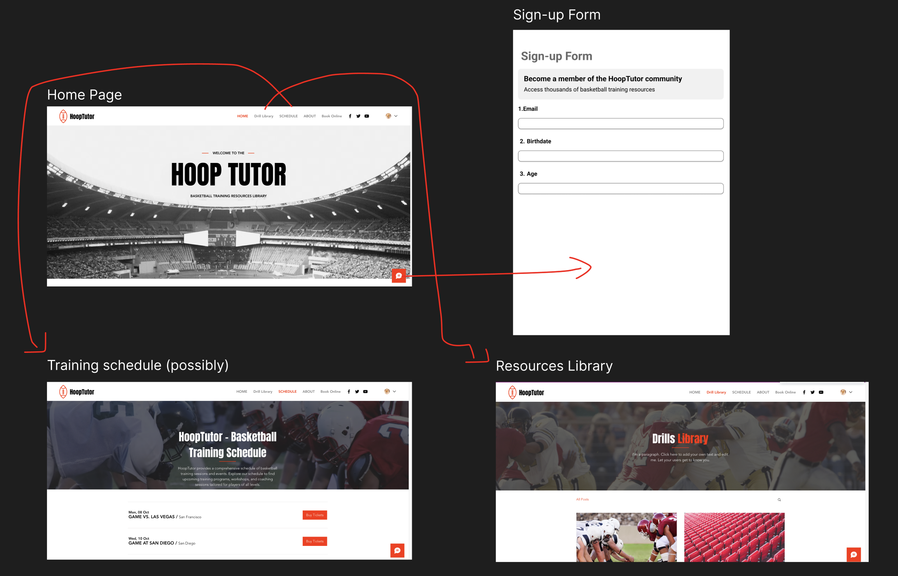

# HoopTutor – Basketball Training Resources Library

**Project Description**

HoopTutor is a simple, interactive website designed to provide basketball players with a curated collection of training resources. The platform organizes drills, workout plans, and educational content into easy-to-navigate categories such as:

- Shooting  
- Ball-handling  
- Defense  
- Fitness

The aim is to create an accessible hub where players of all levels can quickly find trusted drills and tips to improve their game.

**Key Features**

- Categorized library of videos, articles, and images  
- Search and filter by skill level or focus area  
- "Save to Favorites" feature  
- Mobile-friendly design for on-the-go access  

---

**Functional Requirements**

*1. User Interface*

- Homepage with clear category tiles: Shooting, Ball-handling, Defense, Fitness  
- Resource cards showing titles, descriptions, and media  
- Search and filter tools  
- Favorites/bookmark system using browser storage

*2. Content Management*

- Resource database stored in a JSON file or simple CMS  
- Easy to update, add, or remove resources

*3. User Interaction*

- Responsive design for mobile, tablet, and desktop  
- Resource click opens detailed view with instructions/media  
- Favorites persist locally

*4. Deployment*

- Deployed using GitHub Pages for public access

---

**Non-Functional Requirements**

*1. Performance*

- Fast loading with optimized media  
- Lightweight site architecture with minimal dependencies

*2. Usability*

- Intuitive layout with simple navigation  
- Concise, helpful drill descriptions  
- Designed with mobile-first principles

*3. Reliability*

- Local storage for session persistence  
- Error handling for missing or broken media links

*4. Maintainability*

- Modular, readable code using HTML, CSS, JavaScript  
- Simple structure allows non-technical updates

*5. Scalability*

- Future-ready: Easily expandable with more categories or community-submitted drills 

---
## Design Choices (Initial)
| Element         | Choice                                                                 | Reason                                                                                  |
|----------------|------------------------------------------------------------------------|-----------------------------------------------------------------------------------------|
| **Colour Palette** | Primary: #274472 (Dark Blue), Secondary: #A3CEF1 (Light Blue), Accent: #F6F6F6 | Creates a modern, clean, and calming look that feels sporty yet educational            |
| **Typography**     | Headings: 'Montserrat' (bold), Body: 'Open Sans' '                    | Montserrat adds structure and boldness, while Open Sans ensures effective readability            |
| **Button Style**   | Rounded corners, filled primary colour on hover                      | Friendly and accessible; hover feedback adds interactivity                              |
| **Icon Style**     | Flat SVG or minimal outline icons with consistent line weight        | Keeps UI consistent and clean; avoids visual clutter                                   |
| **Imagery**        | Action-oriented photos (e.g. players training or mid-play shots)      | Adds energy and motivation; reflects target audience aspirations                        |
| **Forms**          | Simple layout with floating labels and subtle shadows                | Clean look with high usability on both desktop and mobile                              |

## Initial Design

## Alternative Design

## Design Choices (Alternative)

| Design Element          | Choice Made                                                                                   | Reasoning                                                                                      |
|-------------------------|-----------------------------------------------------------------------------------------------|------------------------------------------------------------------------------------------------|
| **Colour Scheme**       | I used the colours red, white, and black with minimal accents                                              | Red conveys energy and urgency, and black and white keeps it clean and professional |
| **Typography**          | Bold sans-serif for headings, lighter sans-serif for body text                                | Improves readability and makes the headings stand out                                          |
| **Navigation Bar**      | Top horizontal navigation with bold active link highlight (red underline on active page)      | Keeps navigation consistent and visible                                        |
| **Hero Image**          | Full-width background image of basketball players in action                                   | Creates immediate visual engagement and sets a sporty tone                                     |
| **Layout**              | Centralised hero text with call-to-action buttons below event listings                        | Guides the user’s eye from the main title to actionable items                                  |
| **Event Listings**      | Clean list format with date, title, and location; “Buy Tickets” button in red                 | Simple structure allows quick scanning; red buttons draw attention to actions                  |
| **Call-to-Action Buttons** | Bright red with white text                                                                  | High contrast for visibility; consistent with brand colour                                     |
| **Icons/Social Media**  | Small, consistent icons in header for Facebook, Youtube, etc.                              | Provides easy access to community channels without cluttering the page                         |
| **Spacing & Alignment** | Generous white space, consistent padding, and aligned text/button placements                  | Improves visual clarity                            |

## Login Function Algorithm

# User Login Process Flowchart - Test Cases

## Test Case 1 — Valid Login Credentials
| Field | Details |
|-------|---------|
| **Test Case ID** | TC-LOGIN-001 |
| **Test Case Name** | Successful login with correct email and password |
| **Preconditions** | User has a valid account with email and password stored in the database; system is online and accessible |
| **Test Steps** | 1. Navigate to login page 2. Enter registered email in correct format 3. Enter matching password 4. Click “Login” button |
| **Expected Result** | User session is created, and user is redirected to dashboard |
| **Actual Result** | *(To be filled after execution)* |
| **Pass/Fail** | *(To be filled after execution)* |
| **Priority** | High |

---

## Test Case 2 — Empty Fields Validation
| Field | Details |
|-------|---------|
| **Test Case ID** | TC-LOGIN-002 |
| **Test Case Name** | Login attempt with empty email and/or password fields |
| **Preconditions** | System is online; no text entered in one or both fields |
| **Test Steps** | 1. Navigate to login page 2. Leave email and/or password field empty 3. Click “Login” button |
| **Expected Result** | Error message “Please enter both fields” is displayed; no data is sent to server |
| **Actual Result** | *(To be filled after execution)* |
| **Pass/Fail** | *(To be filled after execution)* |
| **Priority** | High |

---

## Test Case 3 — Invalid Email Format
| Field | Details |
|-------|---------|
| **Test Case ID** | TC-LOGIN-003 |
| **Test Case Name** | Login attempt with incorrectly formatted email |
| **Preconditions** | System is online |
| **Test Steps** | 1. Navigate to login page 2. Enter invalid email format (e.g., `username@com`) 3. Enter any password 4. Click “Login” button |
| **Expected Result** | Error message “Invalid email format” is displayed; no data is sent to server |
| **Actual Result** | *(To be filled after execution)* |
| **Pass/Fail** | *(To be filled after execution)* |
| **Priority** | Medium |

---

## Test Case 4 — Incorrect Credentials
| Field | Details |
|-------|---------|
| **Test Case ID** | TC-LOGIN-004 |
| **Test Case Name** | Login attempt with wrong password or unregistered email |
| **Preconditions** | System is online; entered credentials do not match any database record |
| **Test Steps** | 1. Navigate to login page 2. Enter registered email OR unregistered email 3. Enter incorrect password 4. Click “Login” button |
| **Expected Result** | Error message “Incorrect email or password” is displayed; no session is created |
| **Actual Result** | *(To be filled after execution)* |
| **Pass/Fail** | *(To be filled after execution)* |
| **Priority** | High |

## Week 6 - Project Notes 
This week’s focus was on building the foundation of HoopTutor through database design. I began by identifying the key types of data that would be required for the app: categories (e.g., shooting, ball-handling, defense, fitness), drills with descriptions and media, and user information for login and potential saved resources. I set up relationships between these tables by using primary and foreign keys, ensuring that each drill was linked to its category and that users could eventually store favourites.

To test the database structure, I manually entered sample drills and ran SQL queries to confirm that joins across tables worked correctly. These queries retrieved meaningful data such as “all beginner shooting drills” or “all fitness drills saved by a particular user.” One challenge was selecting the appropriate data types for storing media links and text descriptions, as well as ensuring queries were not too basic but rather demonstrated relevance to the app’s goals. The database now provides a solid foundation for the front-end to display dynamic information.

## Week 7 - Project Notes 
The next stage shifted towards the presentation layer. I created three core pages: a homepage with category tiles, a drills library displaying resource cards, and a login page. Each page was styled with CSS to ensure visual clarity and user appeal. I experimented with a modern blue colour palette and rounded button styles to match the intended sporty yet educational tone of HoopTutor.

One of the most significant learning points was linking these static pages to the back-end database so that real data could eventually be displayed. At this stage, I used placeholder content to structure the design and ensure responsiveness across different devices. Running the app locally confirmed that navigation between pages was seamless. While functional, the design still felt basic, so I noted areas for later improvement, such as hover animations and improved alignment.

## Week 8 - Project Notes 
Building on the previous prototype, I refined the site’s look and feel using W3C standards for styling. Improvements included more consistent typography, spacing, and mobile-friendly formatting. I added subtle hover animations for category tiles and buttons, which made the interface more engaging.

I also began researching APIs that could extend the functionality of HoopTutor, such as embedding YouTube drills directly within resource cards. Some formatting issues remained, particularly with aligning text and images on different screen sizes. The client feedback highlighted that while the structure was strong, the app still required polishing to achieve a professional and consistent aesthetic.

## Week 9 - Project Notes 
This week marked the transition from static presentation to interactive functionality. I implemented the service worker, manifest.json, and app.js files to begin enabling offline support. While the initial setup ran without major errors, caching all the required resources proved challenging, and offline functionality was not yet fully operational.

At the same time, I ran the first Google Lighthouse report to evaluate the site’s performance, accessibility, and best practices. The accessibility score was strong, but the performance score highlighted issues with unoptimised media. On the interactive side, I started experimenting with features that would make the site more engaging, such as the ability to save resources to favourites using local storage. Although these features were not fully stable, they demonstrated the potential of HoopTutor as a genuine web app rather than just a static site.

## Week 10 - Project Notes
This week’s focus was on completing the interactivity and addressing client concerns. The login system was refined to display appropriate error messages for invalid email or password entries, which improved the user experience significantly. Work also began on a signup page, although it is not yet fully connected to the back-end.

Offline functionality remains incomplete, and this is now a priority for next term. The service worker has been set up, but it does not yet cache all necessary resources to support smooth offline use. On the design side, some formatting issues were corrected, though others persist, particularly with responsive alignment. A second Lighthouse report was conducted, which showed progress towards W3C compliance but highlighted that performance could still be improved through media optimisation.

The most meaningful progress came from the interactive features: users can now save resources to favourites, and filtering drills by skill level has been introduced. These additions give HoopTutor more practical value to its intended audience. Client feedback was positive about the improvements but emphasised the need to finalise the signup page and achieve offline functionality before user testing next term.
